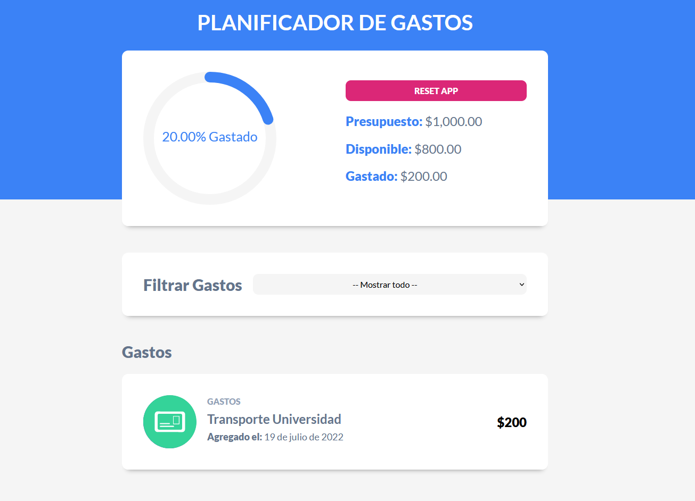

---

# **Aplicación para gestionar gastos en base a presupuesto**

---

## **Swipe en las tareas**

[React-swipeable-list](https://www.npmjs.com/package/react-swipeable-list)
```Javascript
npm i react-swipeable-list
```

### Para aplicarlo:

```javascript

import {
    LeadingActions,
    SwipeableList,
    SwipeableListItem,
    SwipeAction,
    TrailingActions
} from 'react-swipeable-list'
import "react-swipeable-list/dist/styles.css"


 <SwipeableList>
    <SwipeableListIte leadingActions={leadingActions()} trailingActions={trailingActions()}>
        //Componente al que se le puede hacer swipe
    </SwipeableListItem>
</SwipeableList>


//Las funciones a las que llaman

// Al hacer swipe en editar
const leadingActions = () => (
    <LeadingActions>
        <SwipeAction onClick={ () => { setGastoEditar(gasto)}}>
            Editar
        </SwipeAction>
    </LeadingActions>
)

// Al hacer swipe en eliminar
const trailingActions = () => (
    <TrailingActions>
        <SwipeAction 
            onClick={()=>eliminarGasto(id)}
            destructive={true} //Animacion al eliminar el componente
        >
            Eliminar
        </SwipeAction>
    </TrailingActions>
)

```

---

## **Gráfica circular**

[react-circular-progressbar](https://www.npmjs.com/package/react-circular-progressbar)
```Javascript
npm i react-circular-progressbar
```

```Javascript
import {CircularProgressbar, buildStyles} from 'react-circular-progressbar'
import 'react-circular-progressbar/dist/styles.css'

...

// Para aplicar el componente 

<CircularProgressbar 
    styles={buildStyles({
        pathColor: '#3b82f6',
        trailColor: '#f5f5f5',
        textColor: '#3b82f6',
    })}
    value={porcentaje}
    text={`${porcentaje}% Gastado`}
/>

```
---

## **LocalStorage**

```javascript
  const [presupuesto, setPresupuesto] = useState(
    Number(localStorage.getItem('presupuesto')) ?? 0
  );

...

  useEffect(() => { 
    localStorage.setItem('presupuesto',presupuesto ?? 0)
  },[presupuesto]);
```
---

## **Como subí mi proyecto React a github pages**
[Modulo gh-pages](https://www.npmjs.com/package/gh-pages)
```javascript
npm i gh-pages

// En el package.json
{
  "name": "planificador-gastos-react",
  "private": true,
  "homepage": "https://leo-zubiri.github.io/planificador-gastos-react/",
  "version": "0.0.0",
  "scripts": {
    "predeploy":"npm run build",
    "deploy": "gh-pages -d dist",


...

npm run deploy
```

